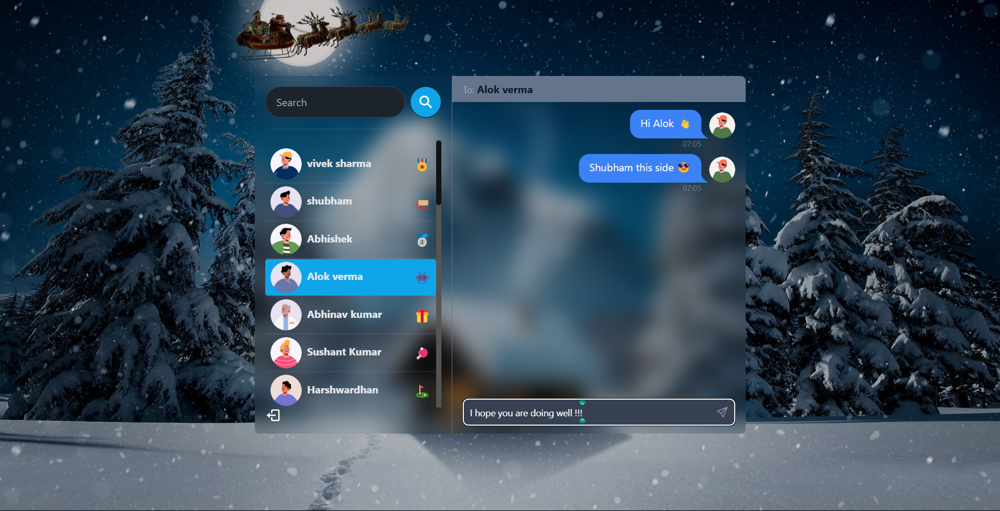

# Chat App

A real-time chat application with user authentication, friend list management, and instant notifications. This app enhances user engagement by providing a seamless chatting experience with alert sounds for incoming messages.

[Live Demo](https://chat-app-e5so.onrender.com/login)

---

## Overview
This project is a modern chat application designed for real-time communication. Key features include:
- **User Authentication:** Secure login and registration.
- **Friend List:** Easily access and chat with your friends.
- **Chatbox:** Instant messaging with real-time updates.
- **Notification Sounds:** Alerts for new messages to enhance engagement.

---

## Features
- **Authentication:** Secure login and signup with hashed passwords.
- **Real-Time Chat:** Smooth and responsive chat interface.
- **Friend List:** Organized view of friends for easy communication.
- **Notifications:** Sound alerts for incoming messages.
- **Responsive Design:** Works seamlessly on various devices.

---

## Screenshots
### Signup Page:


### Home Page:


### Chat Box:


---

## Technologies Used

### Backend
- **Express.js:** Framework for server-side functionality.
- **Mongoose:** For managing MongoDB database.
- **Socket.IO:** For real-time communication.
- **bcryptjs:** For password hashing.
- **jsonwebtoken:** For session management.

### Hosting
- Hosted on Render: [Live Demo](https://chat-app-e5so.onrender.com/login)

---

## Dependencies
```json
{
  "dependencies": {
    "bcryptjs": "^2.4.3",
    "cookie-parser": "^1.4.6",
    "dotenv": "^16.4.5",
    "express": "^4.18.3",
    "jsonwebtoken": "^9.0.2",
    "mongoose": "^8.2.1",
    "socket.io": "^4.7.4"
  }
}
```

---

## Installation

### Prerequisites
- Node.js and npm installed.
- MongoDB database set up.

### Steps
1. Clone the repository:
   ```bash
   git clone https://github.com/shubham-jaishu/mern-chat-app.git
   ```

2. Navigate to the project directory:
   ```bash
   cd mern-chat-app
   ```

3. Install dependencies:
   ```bash
   npm install
   ```

4. Configure environment variables:
   Create a `.env` file and add:
   ```env
   PORT=3000
   MONGO_URI=your_mongodb_connection_string
   JWT_SECRET=your_secret_key
   ```

5. Start the development server:
   ```bash
   npm start
   ```

6. Open your browser and navigate to:
   ```
   http://localhost:3000
   ```

---

## How It Works
1. **Authentication:** Users register and log in with secure credentials. Passwords are hashed using bcryptjs.
2. **Friend List:** Users see a list of friends on the left panel.
3. **Real-Time Chat:** The right panel shows a chatbox for messaging. Messages are updated in real-time using Socket.IO.
4. **Notifications:** Sound alerts play for incoming messages to keep users engaged.

---

## Future Improvements
- Add typing indicators for better real-time feedback.
- Implement message history with database storage.
- Enable group chats.
- Add profile pictures and status updates for users.

---

## License
This project is licensed under the MIT License. See the LICENSE file for details.

---

## Contribution
Contributions are welcome! Feel free to fork the repository and submit a pull request.

---

## Contact
For queries or feedback, please contact [Shubham](mailto:shubhamjaishu@gmail.com).
